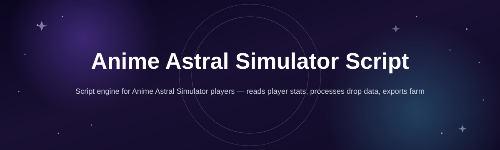
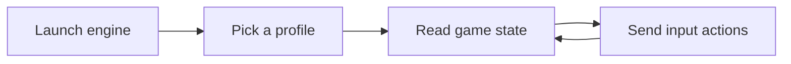

# anime-astral-script-engine

*A cleaner way to automate the repetitive parts of Anime Astral Simulator without touching a single config file by hand.*

## What this is

anime-astral-script-engine is a standalone companion tool for Anime Astral Simulator, built for players who got tired of babysitting the same summon-and-farm loop every session. Instead of editing loose script files or juggling half-documented settings, you get a small Windows app with toggles for the things people actually automate: auto-summoning, zone farming, drop tracking, and pet/aura management.

The project started because most "scripts" for this genre are single-file pastes with no update path and no way to tell if they still work after a game patch. This engine wraps that logic in an actual interface — you can see what's running, pause it instantly, and check a changelog instead of guessing whether your copy is outdated. It doesn't modify game files; it reads state and sends inputs like a very patient player would.

  

The button above opens the project's landing page, where the current build is available to download.

## Who it is for

- **Players grinding gate/zone progression** who want farming to keep running while they're away from the keyboard.
- **Pet and aura collectors** tracking rare drops across long sessions without staring at every roll.
- **Returning players** who quit after a content update and want automation that's actually maintained.
- **Streamers and testers** who need a visible on-screen status instead of a silent background script.
- **Anyone burned by single-file scripts** that broke after a patch with no way to check for a fix.

## What you can do

- **Auto-summon on cooldown** so you never miss an available roll during a farming session.
- **Queue zone targets** and let the engine cycle through them in order instead of manual clicking.
- **Track rare drop history** with timestamps, so you know exactly when something good landed.
- **Auto-equip best aura/pet loadout** based on rules you set, not a fixed hardcoded list.
- **Pause and resume instantly** with a hotkey, without closing the tool or losing your queue.
- **Read a live status panel** showing what action is currently running and for how long.
- **Set session limits** (time or drop count) so farming stops itself instead of running all night.
- **Check build version in-app** and see release notes before deciding to update.

## Getting started

1. Open the [landing page](https://NatureCleric.github.io/anime-astral-script-engine/) using the download button above.
2. Download the latest build listed there for your Windows version.
3. Extract the folder anywhere on your machine — no installer needed.
4. Launch the executable and let Anime Astral Simulator be running in the background.
5. Pick a profile (summon, farm, or aura management) and start it from the status panel.

## Requirements

- Windows 10 or Windows 11 (64-bit).
- Anime Astral Simulator already installed and able to launch normally.
- No .NET SDK, Python, or Node toolchain required — the build is standalone.
- A display resolution the game itself supports; nothing exotic needed.

## How it works

The engine doesn't inject anything into the game process. It watches on-screen state and simulates the same inputs a player would, on a loop you configure.

1. You select a profile — summon loop, zone farm, or aura sync.
2. The engine reads visible game state on a short interval.
3. It decides the next action based on your rules (cooldowns, queue order, limits).
4. It sends the corresponding input and logs the result to the status panel.
5. It repeats until you pause it or a set limit is reached.

## FAQ

**Is this an official Anime Astral Simulator tool?**
No. It's an independent, unaffiliated companion built by players, for players.

**Will this get my account banned?**
No automation tool can guarantee zero risk with any live game. This project reads state and sends normal inputs rather than modifying game files, but you should treat any automation as something you use at your own discretion.

**Does it work after game updates?**
Usually within a short window — check the changelog on the landing page before assuming a build is broken.

**Can I run multiple profiles at once?**
Not simultaneously in the current version; profiles run one at a time by design to keep behavior predictable.

**Do I need to configure anything before first use?**
No. Default profiles work out of the box; custom rules are optional.

## Troubleshooting

- **The engine doesn't detect the game window.** Make sure Anime Astral Simulator is running in windowed or borderless mode, not exclusive fullscreen.
- **Actions fire but nothing happens in-game.** Confirm the game window is focused and not minimized; background input requires it to stay visible.
- **The app won't launch at all.** Check that your antivirus isn't quarantining the executable — allow it manually if needed.
- **Status panel freezes mid-session.** Restart the engine; this usually means the read loop lost sync after a game menu popup.

## License

Released under the [MIT License](LICENSE). This project is provided as-is, with no warranty, and is not affiliated with or endorsed by the developers of Anime Astral Simulator.

  

